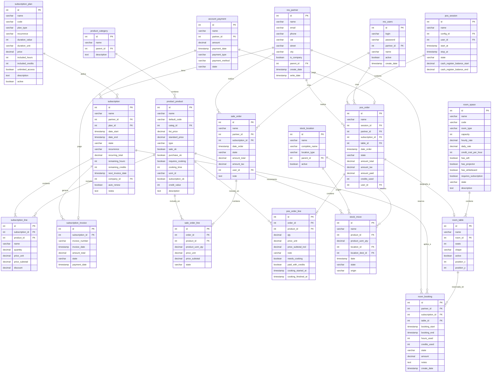

# workspace cafe
> Sistema de Gestión para Café con Salas de Trabajo

## Descripción General

Este documento describe la estructura de la base de datos PostgreSQL diseñada para gestionar un café que ofrece diferentes salas de trabajo, servicio de alimentos (productos preparados y cocinados), y un sistema de suscripciones para clientes individuales y empresariales.

## Diagrama Entidad-Relación



## Módulos Principales

### 1. Gestión de Clientes y Usuarios

#### `res_partner`
Tabla central para almacenar información de clientes, proveedores y contactos. Soporta tanto clientes individuales como empresas.

**Campos destacados:**
- `is_company`: Indica si es una empresa o un individuo
- `parent_id`: Permite jerarquías (empleados de una empresa)
- `vat`: NIT o identificación fiscal

#### `res_users`
Gestiona usuarios del sistema (empleados, administradores, cajeros).

### 2. Sistema de Suscripciones

#### `subscription_plan`
Define los planes de suscripción disponibles:
- **Planes individuales**: Para freelancers o profesionales independientes
- **Planes empresariales**: Para compañías que necesitan múltiples accesos

**Características:**
- `plan_type`: Tipo de plan (individual/empresarial)
- `recurrence`: Frecuencia de cobro (mensual, trimestral, anual)
- `included_hours`: Horas de uso de salas incluidas
- `included_credits`: Créditos para consumos
- `unlimited_access`: Acceso ilimitado a espacios

#### `subscription`
Suscripciones activas de los clientes.

**Estados posibles:**
- `draft`: Borrador
- `active`: Activa
- `suspended`: Suspendida
- `cancelled`: Cancelada

**Campos clave:**
- `remaining_hours`: Horas disponibles en el período actual
- `remaining_credits`: Créditos disponibles
- `auto_renew`: Renovación automática
- `company_id`: Empresa asociada (para suscripciones corporativas)

#### `subscription_line`
Líneas de detalle de cada suscripción (productos/servicios incluidos).

#### `subscription_invoice`
Facturas generadas automáticamente por las suscripciones recurrentes.

### 3. Gestión de Productos

#### `product_category`
Categorización jerárquica de productos:
- Bebidas frías
- Bebidas calientes
- Alimentos preparados
- Alimentos para cocinar
- Servicios (uso de salas)

#### `product_product`
Catálogo completo de productos y servicios.

**Campos específicos para el café:**
- `requires_cooking`: Indica si el producto debe prepararse en cocina
- `cooking_time`: Tiempo estimado de preparación (en minutos)
- `subscription_ok`: Si puede incluirse en suscripciones
- `credit_value`: Valor en créditos de suscripción

### 4. Punto de Venta (POS)

#### `pos_session`
Sesión de caja de un empleado. Controla:
- Apertura y cierre de caja
- Balance inicial y final
- Usuario responsable

#### `pos_order`
Órdenes realizadas en el punto de venta.

**Integración con suscripciones:**
- `subscription_id`: Si la orden usa una suscripción
- `credits_used`: Créditos aplicados al pago

#### `pos_order_line`
Líneas de detalle de cada orden.

**Control de cocina:**
- `needs_cooking`: Requiere preparación
- `paid_with_credits`: Pagado con créditos de suscripción
- `cooking_started_at`: Inicio de preparación
- `cooking_finished_at`: Finalización

### 5. Gestión de Salas y Espacios

#### `room_space`
Salas de trabajo disponibles en el café.

**Tipos de salas:**
- Sala privada
- Sala compartida
- Sala de conferencias
- Espacio de coworking

**Características:**
- `capacity`: Capacidad de personas
- `hourly_rate`: Tarifa por hora
- `daily_rate`: Tarifa por día completo
- `credit_cost_per_hour`: Costo en créditos de suscripción
- `requires_subscription`: Si solo suscriptores pueden reservar
- Amenidades: WiFi, proyector, pizarra

#### `room_table`
Mesas individuales dentro de cada sala. Permite:
- Asignación específica de mesas
- Posicionamiento visual (`position_x`, `position_y`)
- Control de capacidad por mesa

#### `room_booking`
Reservaciones de salas y mesas.

**Gestión de pagos:**
- Puede usar horas de suscripción
- Puede usar créditos
- Puede ser pago directo

**Estados:**
- `draft`: Borrador
- `confirmed`: Confirmada
- `in_progress`: En uso
- `done`: Completada
- `cancelled`: Cancelada

### 6. Ventas

#### `sale_order`
Órdenes de venta más formales (catering, eventos, ventas corporativas).

#### `sale_order_line`
Líneas de detalle de órdenes de venta.

### 7. Inventario

#### `stock_location`
Ubicaciones de inventario:
- Almacén principal
- Cocina
- Barra de café
- Áreas de servicio

#### `stock_move`
Movimientos de inventario (entradas, salidas, transferencias).

**Estados:**
- `draft`: Borrador
- `confirmed`: Confirmado
- `done`: Realizado
- `cancelled`: Cancelado

### 8. Pagos

#### `account_payment`
Registro de todos los pagos realizados.

**Métodos de pago:**
- Efectivo
- Tarjeta de crédito/débito
- Transferencia
- Créditos de suscripción

## Flujos Principales

### Flujo 1: Cliente con Suscripción Consume en el Café

1. Cliente presenta su suscripción activa
2. Se crea `pos_order` vinculado a `subscription`
3. Se agregan productos a `pos_order_line`
4. Sistema verifica `remaining_credits` en `subscription`
5. Se descuentan créditos o se cobra diferencia
6. Si hay productos con `requires_cooking = true`, se marca `needs_cooking`
7. Cocina prepara orden (se registra `cooking_started_at` y `cooking_finished_at`)

### Flujo 2: Reservación de Sala con Suscripción

1. Cliente selecciona `room_space` disponible
2. Se crea `room_booking` vinculado a `subscription`
3. Sistema verifica `remaining_hours` en `subscription`
4. Se calculan horas a usar según `booking_start` y `booking_end`
5. Se descuentan horas o créditos de la suscripción
6. Al finalizar, se actualiza estado a `done`

### Flujo 3: Renovación de Suscripción

1. Sistema verifica `next_invoice_date` en `subscription`
2. Si fecha actual >= `next_invoice_date` y `auto_renew = true`
3. Se crea `subscription_invoice`
4. Se genera `account_payment` al confirmarse el pago
5. Se actualizan `remaining_hours` y `remaining_credits`
6. Se calcula nueva `next_invoice_date`

### Flujo 4: Control de Inventario

1. Productos consumidos generan `stock_move` desde `stock_location` cocina/barra
2. Sistema actualiza cantidades disponibles
3. Alertas cuando stock llega a mínimo
4. Reposiciones generan `stock_move` hacia ubicaciones de venta

## Consideraciones de Implementación

### Índices Recomendados

```sql
-- Búsquedas frecuentes de clientes
CREATE INDEX idx_partner_email ON res_partner(email);
CREATE INDEX idx_partner_phone ON res_partner(phone);

-- Suscripciones activas
CREATE INDEX idx_subscription_state ON subscription(state);
CREATE INDEX idx_subscription_dates ON subscription(date_start, date_end);

-- Órdenes por fecha
CREATE INDEX idx_pos_order_date ON pos_order(date_order);
CREATE INDEX idx_sale_order_date ON sale_order(date_order);

-- Reservaciones por fecha
CREATE INDEX idx_booking_dates ON room_booking(booking_start, booking_end);

-- Productos más vendidos
CREATE INDEX idx_product_active ON product_product(sale_ok);
```

### Constraints Importantes

```sql
-- Email único para partners
ALTER TABLE res_partner ADD CONSTRAINT unique_partner_email 
UNIQUE(email);

-- Una suscripción activa por cliente
CREATE UNIQUE INDEX idx_one_active_subscription 
ON subscription(partner_id) 
WHERE state = 'active';

-- No permitir overlapping de reservaciones
-- (requiere extensión btree_gist)
ALTER TABLE room_booking ADD CONSTRAINT no_booking_overlap
EXCLUDE USING gist (
  table_id WITH =,
  tsrange(booking_start, booking_end) WITH &&
) WHERE (state != 'cancelled');
```

### Validaciones a Nivel de Aplicación

1. **Créditos suficientes**: Verificar `remaining_credits` antes de confirmar orden
2. **Horas disponibles**: Validar `remaining_hours` antes de crear reservación
3. **Stock disponible**: Confirmar inventario antes de confirmar orden
4. **Capacidad de sala**: No exceder `capacity` en reservaciones
5. **Estado de suscripción**: Solo permitir uso si `state = 'active'`

## Extensiones Futuras

- **Programa de lealtad**: Acumulación de puntos por consumo
- **Notificaciones**: Alertas de vencimiento de suscripción
- **Reportes analíticos**: Dashboard de KPIs
- **App móvil**: Reservaciones y órdenes desde aplicación
- **Integración contable**: Exportación a sistemas contables
- **Multi-sucursal**: Gestión de múltiples ubicaciones

## Tecnologías Recomendadas

- **Base de datos**: PostgreSQL 13+
- **ORM**: SQLAlchemy o Django ORM
- **API**: FastAPI o Django REST Framework
- **Frontend**: React o Vue.js
- **Autenticación**: JWT tokens
- **Pagos**: Stripe o PayPal integration

## Notas de Migración

Al implementar esta base de datos, considerar:

1. Crear secuencias para los códigos de órdenes, suscripciones, etc.
2. Cargar datos maestros iniciales (categorías, ubicaciones de stock)
3. Configurar usuario administrador inicial
4. Establecer configuración de impuestos según legislación local
5. Definir planes de suscripción según modelo de negocio

---

**Versión**: 1.0  
**Última actualización**: Octubre 2025  
**Autor**: Equipo de Desarrollo
