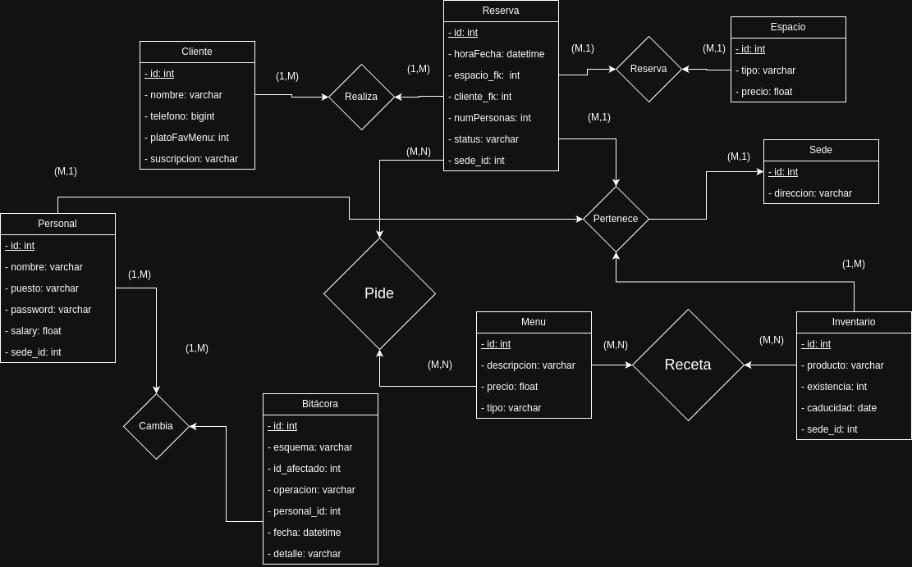

# workspace cafe
> Sistema de Gestión para Café con Salas de Trabajo

## Descripción General

Este documento describe la estructura de la base de datos PostgreSQL diseñada para gestionar un café que ofrece diferentes salas de trabajo, servicio de alimentos (productos preparados y cocinados), y un sistema de suscripciones para clientes individuales y empresariales.

## Diagrama Entidad-Relación

